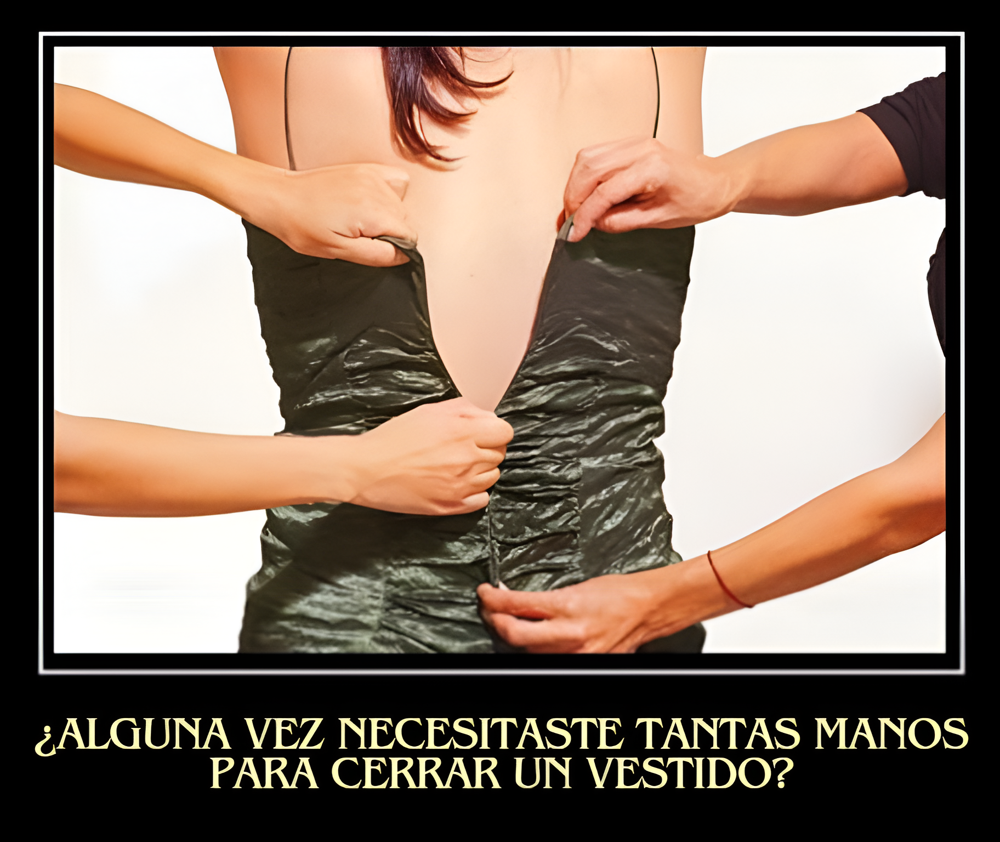

# Vestidos para cuerpos reales

Hace unos meses comencé con muchisima ilusión la busqueda del vestido perfecto para mi graduación, sin embargo, tras ojear unas cuántas webs y visitar la mayoría de las tiendas de mi ciudad me di cuenta de algo, o los fabricantes se habían olvidado de mi talla o no encajaba en los patrones de la moda normativa. Me considero una mujer dentro de la media española, ni muy alta ni muy baja, ni muy delgada ni muy gorda, simplemnete en la media, o lo que yo pensaba que era la media. Por lo que investigué un poco qué estaba pasando con las tallas y descubrí que no estaba sola, que miles de mujeres se encontraban en la misma situación que yo. Me leí numerosos artículo hablando del tema, todos mencionaban una misma fuente, la Asecom (La Asociación de empresas de confección y moda de la comunidad de Madrid), la cual realizó un estudio en el cual asegura que las tallas 42 y 44 son las que más se venden en España, pese a que los escaparates no muestran precisamente a maniquíes con dichas medidas.

Finalmente encontré mi vestido, pero me costó. Por lo que unos meses más tarde y ya con las herramientas y conocimientos necesarios planteo este proyecto abordando un problema real: ¿Son los vestidos de hoy para las mujeres del hoy? 

Se inicia este proyecto a pequeña escala, analizando 4 de las marcas que visité hace unos meses en busca de vestido las cuales son: Mango, Forever21, Natural by Lila y Ladypipa. Siendo Mango una gran cadena mundial, Forever21 una firma estadounidense bastante popular en paises europeos como Irlanda o Inglaterra y las últimas dos son tiendas españolas, por lo que hay bastante variedad. 