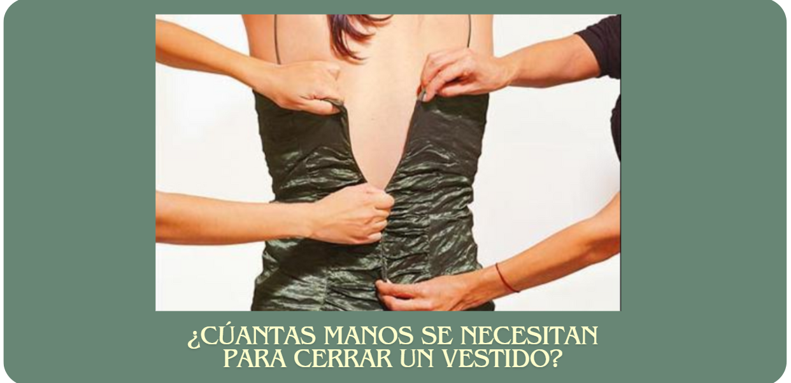

# 👗 Vestidos para Cuerpos Reales 



# 💡 Introducción al proyecto 

Hace unos meses comencé con muchisima ilusión la busqueda del vestido perfecto para mi graduación, sin embargo, tras ojear unas cuántas webs y visitar la mayoría de las tiendas de mi ciudad me di cuenta de algo, o los fabricantes se habían olvidado de mi talla o no encajaba en los patrones de la moda normativa. Me considero una mujer dentro de la media española, ni muy alta ni muy baja, ni muy delgada ni muy gorda, simplemnete en la media, o lo que yo pensaba que era la media. Por lo que investigué un poco qué estaba pasando con las tallas y descubrí que no estaba sola, que miles de mujeres se encontraban en la misma situación que yo. Me leí numerosos artículo hablando del tema, todos mencionaban una misma fuente, la Asecom (La Asociación de empresas de confección y moda de la comunidad de Madrid), la cual realizó un estudio en el que asegura que las tallas 42 y 44 son las que más se venden en España, pese a que los escaparates no muestran precisamente a maniquíes con dichas medidas.

Finalmente encontré mi vestido, pero me costó. Por lo que unos meses más tarde y ya con las herramientas y conocimientos necesarios planteo este proyecto abordando un problema real: **쯉on los vestidos de hoy para las mujeres del hoy?**

Se inicia este proyecto a pequeña escala, analizando nueve de las marcas que visité hace unos meses en busca de vestido las cuales son: Mango, Forever21, Ghospell, Jaded Rose, Love Triangle, NA-KD, Vero Moda, Natural by Lila y Ladypipa. Siendo estas tiendas muy diversas a pqueñas y gran escala tanto españolas como europeas o americanas.


# 🎯 Objetivo 

El objetivo fundamental entorno al cual se desarrolla este proyecto consiste en descubrir si las marcas objeto de nuestro estudio ofrecen diversidad de tallas y suficiente oferta de tallas L y XL, las cuales son las más consumidas en España. Para ello almacenaremos todos los datos recabados y observaremos y analizaremos las siguientes cuestiones:

- La ditribución de vestidos por marca.
- La distribución de prendas por talla para cada marca.
- El precio medio y mediano para los vestidos de cada marca.
- El precio medio y mediano por tallas.
- El porcentaje de prendas por tallas para distintos tipos de vestidos.
- La distribución de vestidos por tallas.

Además, de la marca Forever21 hemos conseguido obtener el stock para cada vestido y talla por lo que también serán analizados estos datos.

# 📁 Estructura

- El proyecto consiste en la implementación de una ETL y un posterioir análisis. Se ha estructurado en una primera fase de extracción de datos. Los datos se han obtenido mediante APIs y scraping de dos páginas web. Las APIs son: [Asos](https://rapidapi.com/DataCrawler/api/asos10) y [Forever21](https://rapidapi.com/apidojo/api/forever21) y las páginas web: [NaturalByLila](https://naturalbylila.com/) y [Ladypipa](https://ladypipa.com/). 

    - La obtención de información de las APIs se ha llevado a cabo en los notebooks 1 y 2 que se pueden encontrar en la carpeta `notebooks` apoyandose en el archivo de `funciones_api.py` de la carpeta `src`. Los datos extraidos han sido almacenados en la carpeta `datos` dentro de `api_asos` y `api_forever21`.

    - El scraping de las webs se puede encontrar en los notebooks `3-scraping_lila.ipynb` y `4-scraping_ladypipa.ipynb` y las funciones de apoyo en la carpeta `src` en el archivo `funciones_craping.py`. 

- Una vez etraidos todos los datos pasamos a la segunda fase de la ETL que es la transformación y limpieza, llevada a cabo en el notebook `5-limpieza.iynb`. En esta fase limpiamos las columnas de cada dataframe añadiendo nuevas columnas o quitando alguna existente y normalizando los datos para poder unificar todos los datos obtenidos en la primera fase.

- El último paso es la creación y carga de los datos en una base de datos SQL, este paso se ejecuta en el notebook `6-creacion_insercion_bbdd.ipynb` apoyandose en las funciones del archivo `funciones_bbdd.py` y `queries.py`. Se crea la base de datos, las tablas y se realizan las consultas necesarias para insertar todos los datos en nuestra base de datos. 

- Finamente, pasamos a la fase del análisis mediante consultas SQL. En esta fase extraeremos la información relevante para analizar las propuestas planteadas como objetivo y mostrar gráficas para observar de una forma más visual los resultados. Toda esta información se puede encontrar en el notebook `7-analisis.ipynb` apoyado en las funciones de `funciones_analisis.py`.

Por lo tanto, el contenido de las carpetas es el siguiente:

- **datos/**: Contiene los datos obtenidos de las APIs y el scraping.
  - **api_asos**: Datos obtenidos de la API de ASOS.
  - **api_forever21**: Datos obtenidos de la API de Forever21.
  - **scraping**: Datos obtenidos mediante técnicas de scraping.
  - **dataframes**: Donde se almacenan los dataframes limpios de cada marca.

- **graficos/**: Contiene las visualizaciones generadas a partir de los datos.

- **notebooks/**: Jupyter notebooks con el código y análisis del proyecto.

- **src**: Scripts de Python con funciones de apoyo para los noteboks.


#  📝 Conclusiones 

- **Análisis por marca**

    - Forever21 al ser una gran marca confecciona vestidos para casi todas las tallas, desde la XS hasta la 5XL, siendo de las pocas que alcanza tallas tan grandes. Sin embargo, es extraño que no produzcan tallas menores a la XS cuando producen tantas tallas grandes, dejando fuera esa parte del mercado. En cuanto a las tallas, como era de esperar las más producidas son S,M, L casi por igual y seguida de cerca por la XL y XS.

    - Ghospell se centra principalmente en la talla M, duplicando la cantidad de vestidos de esta talla respecto a otras tallas como la S o la L. En este caso no se porducen vestidos de la talla XL, talla la cual representaría una 46, que es la tercera talla más vendida en España.

    - Respecto a JadedRose y Love Triangles qué decir, se centra en un cuerpos de unas medidad irrealistas dejando fuera una gran cantidad de mujeres españolas, ya que no producen tallas L ni XL, pero si XXS y XS lo cual es bastante impactante.

    - LadyPipa tiene una gran variedad de tallas produciendo desde la XXS hasta la 5XL siendo la marca que más tallas abarca. Sin embargo si que es verdad que la cantidad de vestidos ofrecidos para las tallas L y XL es menor que para la M, S, XS y XXS. Hay que destacar que se ofrecen más vestidos de una talla XXS que de una talla L, recalcando de nuevo el serio problema que se vive en España, encima siendo esta una marca Española la cual se centra en un público de medidas nada cercanas a las medidas de las mujeres reales españolas.

    - Respecto a Mango y Naked ambos producen la misma cantidad de tallas S, M y L, menor cantidad de XS y en el caso de mango es la única que produce XL, lo cual es bastante sorprendente dado que Mango al ser una franquicia tan grande esperaba que intentara llegar más a todos lo públicos pues tiene los suficientes medios como para poder producir más tallas. 

    - Natural by Lila es una marca muy pequeña que debido a su poco presupuesto decide centrarse en un claro protipo de mujer, siendo la mayor parte de sus vestidos de talla única que según su web se ajustarían a cuerpos de una talla S/M, dejando fuera a una gran cantidad de mujeres españolas. Ya que en españa la talla más usada es la L es sorprendente que un negocio que la mayor parte de sus ventas son en España no incluya esta talla. 

    - Finalmente Vero Moda ofrce para casi todos sus vestidos tallas desde la XXS hasta la XXL, siendo la que más se acerca a todos los públicos por igual.

- **Precio por tallas**

    Las tallas S y M comparten una misa mediana de 60 euros mientras que la talla L, la cual es la más vendida en España, tiene una mediana de 66, 6 euros más. En cuanto a la XL si que vuelve a estar la mediana entorno al 60. Siendo la L la talla que más mujeres usan, es sorprendente ver que su precio medio es superior al de la talla S o M.

- **Talla y tipo de vestido**

    Hemos agrupado los vestidos en 3 categorías: corto, midi y largo. Se puede observar una grave problemática en cuanto a la oferta de tallas L en vestidos largos, con tan solo un 8% del total. Como era de esperar en todas las categorías predomina la mayor oferta de vestidos de la talla M y S, siendo en los vestidos largos donde más está acentuada esta diferencia. En cuanto a los vestidos cortos la talla L representa un 15% frente al 26% de la M y 24% de la S. En los vestidos midi está más repartido el porcentaje de tallas, predominando la talla M y descendiendo este porcentaje según se aumenta de talla.

- **Distribución de vestidos por talla**


Finalmenete, con esta gráfica podemos concluir respondiendo a la pregunta incial de nuestro estudio: 쮼stán hechos los vestidos de hoy para las mujeres españolas de hoy? La respuesta claramente es no. La línea roja representa la mediana de las tallas de las nueve tiendas analizadas, mientras que la linea verde representa la talla real más vendida en España en mujeres. Hay un gran escalón entre la talla M y la L el cual deja claro que al sector de la moda aún le queda un largo camino por recorrer para acercarse más a la oferta necesaria para las mujeres reales.

Si deseas ver estos datos y muchos otros en más detalle, no dudes en consultar el notebook `7-analisis.ipynb`.

## Instalación y Requisitos

Este proyecto usa Python 3.11 y requiere las siguientes bibliotecas:
- [numpy](https://numpy.org/doc/stable/)
- [pandas](https://pandas.pydata.org/docs/reference/frame.html)
- [json](https://docs.python.org/3/library/json.html)
- [dotenv](https://pypi.org/project/python-dotenv/)
- [requests](https://requests.readthedocs.io/en/latest/)
- [BeautifulSoup](https://pypi.org/project/beautifulsoup4/)
- [Selenium](https://www.selenium.dev/documentation/)
- [psycopg2](https://pypi.org/project/psycopg2/)
- [plotly](https://plotly.com/python/)

Para el funcionamiento del proyecto en tu local:

1. Descarga [DBeaver](https://dbeaver.com/docs/dbeaver/).

2. Accede con tu cuenta a [Rapidapi](https://rapidapi.com) y genera claves para las dos APIs anteriormente mencionadas. Almacena estas claves en un documento .env y no las compartas.

3. Clona el repositorio
   ```sh
   git clone git@github.com:elenacano/Protecto5-VestidosParaCuerposReales.git
   ```

4. Ejecuta el código de los notebooks en el oden especificado.
